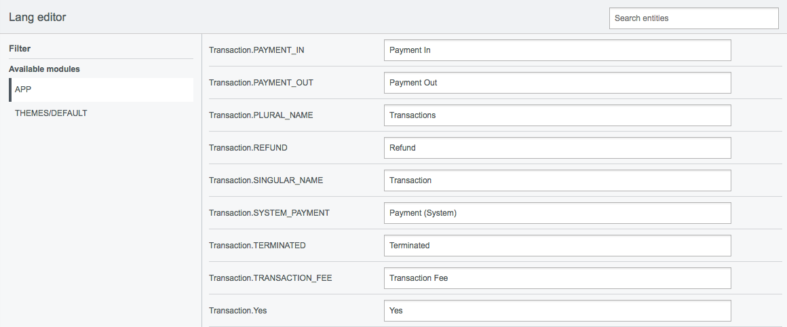

# SilverStripe Language Editor

Language editor for SilverStripe CMS. It's alternative to [https://github.com/unclecheese/LangEditor](https://github.com/unclecheese/LangEditor), but this one collect entities to the database to avoid file writing at the project (and to avoid versioning). All entities with module's store to `LangModule` and `LangEntity`.



## Collect entities

To collect an entities you need to have `phpunit` installed. Module using `i18nTextCollector` class which are on top of `phpunit` to collect entities. 
If you already have `phpunit` run command in cli:

```shell
php /your-project/directory/framework/cli-script.php dev/tasks/LangCollectorTask "module=yourModuleName,otherModuleName&merge=true"
```

or in the browser `example.com/dev/tasks/LangCollectorTask?module=yourModuleName,otherModuleName&merge=true`.

| Parameter | Description | Options | Default |
|--------------------------|-------------------------------------------------------------------------------------------------------------------------------------------------------------------------------|------------------|-------------|
| module | One or more modules to limit collection (comma-separated) | string |  |
| merge | Merge new strings with existing ones already defined | boolean | false |

## Installation

```shell
composer require navidonskis/silverstripe-language-editor
```
